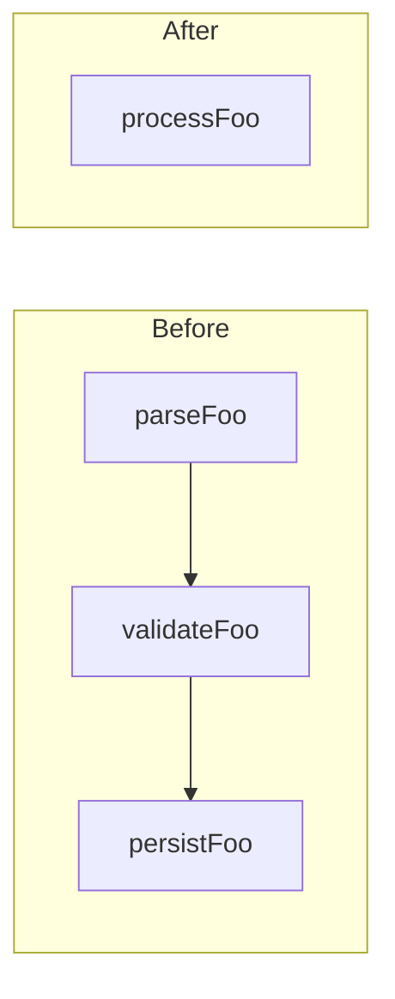

# Module depth review

**Find shallow modules. Propose deep ones.**

A shallow module has an interface nearly as complex as its implementation — it forces callers to learn a lot for little behavioural payoff. A deep module hides substantial behaviour behind a small interface. This skill audits a region of the codebase against that lens and proposes consolidations.

This is an **audit skill**. It produces findings and proposals — never edits. Pair with `audit-vs-fix-discipline` for the output discipline.

## When to use

Apply when the user asks about module boundaries, file organisation, or "is this over-modularised?". Concrete triggers:

- "Is this folder doing too much / too little?"
- "Should these be one module?"
- "Too many small files for one concept"
- "The interface is as complex as the implementation"
- "Review the architecture of X" (where X is a feature or subsystem, not the whole app)

**Not the right skill for:**
- Tactical complexity inside a function — use `simplify`
- Removing dead code or orphans — use `cleanup`
- Whole-app architecture decisions — use the `architect` agent
- Pre-merge multi-file review — use `architect-reviewer`

## Vocabulary discipline

This skill uses precise terms. Do not substitute "component," "service," "API," "boundary," or "layer" — those words drift in meaning across teams and obscure the question being asked.

The full glossary lives in @language.md. The short version:

- **Module** — anything with an interface and an implementation. Scale-agnostic (function, class, package, slice).
- **Interface** — everything a caller must know to use the module correctly. Includes signature, invariants, ordering, error modes, perf characteristics. Wider than "API".
- **Depth** — leverage at the interface. Lots of behaviour per unit of interface a caller must learn = deep. Interface nearly as complex as implementation = shallow.
- **Seam** — where the interface lives. Distinct from what sits behind it.
- **Adapter** — a concrete thing that satisfies an interface at a seam.
- **Leverage** — what callers get from depth.
- **Locality** — what maintainers get from depth (change concentrates in one place).

Use these exact words in findings. Vocabulary drift is the failure mode.

## Process

### 1. Frame the region

Confirm with the user what region is in scope: a folder, a subsystem, a feature. Don't audit the whole codebase. If unclear, ask.

### 2. Walk the region

Read the files in scope. For each module, ask the **deletion test**:

> If I deleted this module and inlined its contents into the call sites, would complexity vanish (it was a pass-through) or reappear distributed across N callers (it was earning its keep)?

If complexity vanishes → it's a shallow module candidate for consolidation.
If complexity reappears → it's earning its keep. Leave it.

Also flag:
- Concepts scattered across many small modules that mostly call each other
- Interfaces with as many methods/parameters as the implementation has lines
- Functions extracted purely for test coverage with no true locality benefit
- Tight coupling that leaks across a seam (a "boundary" the implementation routinely bypasses)
- Single-adapter ports — an interface with only one implementation is hypothetical, not a real seam

### 3. Categorise dependencies

For each shallow-module candidate, classify its dependencies — this determines the consolidation shape and testing strategy. See @dependency-categories.md for the four categories (in-process, local-substitutable, remote-owned, true-external) and the testing strategy each one implies.

Without this step, "just merge them" recommendations skip the question of how the deepened module gets tested.

### 4. Produce findings

Output template — markdown, no HTML reports:

```
## Module depth review: <region>

### Candidates for deepening

#### 1. <one-line title>

**Strength:** Strong | Worth exploring | Speculative
**Dependency category:** in-process | local-substitutable | remote-owned | true-external

**Files involved:**
- `path/a.ts`
- `path/b.ts`
- `path/c.ts`

**Current shape:**
Three shallow modules. `a.ts` exposes `parseFoo`, `b.ts` exposes `validateFoo`, `c.ts` exposes `persistFoo`. Every caller invokes all three in sequence; the only callers of each are the others plus one top-level entry point. Interfaces total 9 functions; implementations total ~80 lines.

**Deletion test result:**
Inlining each into the single top-level caller eliminates ~60 lines of glue and the 9-function surface area. Complexity doesn't reappear elsewhere — it was glue, not encapsulation.

**Proposed deep module:**
One module exposing `processFoo(input): Result`. Three private helpers inside; one public entry point.

**Wins:**
- **Leverage:** callers learn one function instead of three.
- **Locality:** changes to the parse/validate/persist sequence happen in one place.
- **Test surface:** one interface to assert against, not three.

**Diagram:**



#### 2. <next candidate...>

### Shallow modules that are actually earning their keep

(Optional section — name modules that *looked* shallow but passed the deletion test. Useful when the user expected them flagged.)

### Top recommendation

Of the N candidates above, #X is the strongest because <reason rooted in leverage/locality>. The others are worth exploring once #X lands.

---
Want me to dig deeper into any candidate? Specify by number. Or want me to draft the consolidation as a fix (separate task)?
```

If no candidates found, say so. Empty findings are valid — don't manufacture shallow modules.

## Calibration

A clean review is a valid outcome. The codebase is allowed to be well-shaped. Inventing candidates to seem thorough is the failure mode this skill exists to prevent.

**Confidence gate: ≥80% sure the consolidation would improve the codebase, or downgrade to "Speculative" or drop entirely.**

**Pre-finding checks:**

1. Have I actually read the call sites of each module in the candidate?
2. Can I name the leverage and locality wins concretely, not in the abstract?
3. Does the deletion test point clearly at "complexity vanishes" or am I guessing?
4. Have I categorised the dependencies, so the consolidation has a testing strategy?

If any answer is "no" → drop the candidate or move it to Suggested follow-ups.

**Do NOT flag:**

- Modules that look small but pass the deletion test (complexity would reappear)
- Single-file utilities that genuinely have no related siblings to merge with
- "Could be deeper" without naming what behaviour would move behind the interface
- Folder organisation preferences ("these should be in `lib/` not `utils/`")
- Anything you can't tie to a concrete leverage or locality win

## Seam discipline

When proposing a deep module that crosses a network or external-service boundary:

- **One adapter is a hypothetical seam. Two adapters is a real one.** Don't propose a port unless at least two adapter implementations are justified (typically a production adapter and a test adapter, or two production targets).
- **Internal seams stay internal.** A deep module can have private seams used by its own tests. Don't expose them at the public interface just because tests use them.
- **The interface is the test surface.** If you'd want to test past the proposed interface, the module is shaped wrong — adjust the proposal.

## Optional: design it twice

For high-impact candidates (Strong strength, large surface area, or contentious shape), explicitly explore alternative designs before recommending one. Approaches:

- **Minimise the interface** — what's the smallest possible API that still does the job?
- **Maximise flexibility** — what if every caller wanted to vary one knob?
- **Optimise the common case** — what's the shape if 90% of calls take one path?
- **Port-and-adapter** — if a network/external dep is involved, what does the production-vs-test adapter split look like?

Present 2-3 designs, contrast them on depth/locality/seam placement, then make a recommendation. Don't always do this — for clear-cut cases it's overhead.

## Red flags — STOP and re-anchor

- About to recommend consolidating modules without checking the call sites
- About to say "this is a god module" without applying the deletion test (god modules can also be deep — the question is whether the interface is small)
- About to introduce a port with one adapter (that's not a seam, that's indirection)
- About to use the words "component", "service", "API", or "boundary" instead of the precise term
- About to bundle the audit and a fix into one response
- About to manufacture a candidate because the report looked empty

**Each of these means: stop. Re-read @language.md or @dependency-categories.md before continuing.**

## Per-project override

Before reviewing, check the project root for `REVIEW.md` (general review policy) or `ARCHITECTURE.md` (project-specific architectural conventions). If present, they override this skill's defaults. Common overrides:

- "This codebase deliberately uses many small modules — flag only depth issues at the package level."
- "Ports and adapters are not used here; propose direct dependencies instead."
- "Don't propose consolidations across these specific folders (they're owned by different teams)."

## When NOT to use

- The user wants tactical complexity reduction inside one function — use `simplify`.
- The user wants to remove dead code or orphans — use `cleanup`.
- The user wants whole-app architectural decisions (which database, which framework) — use the `architect` agent.
- The user has already authorised fixes (`audit and consolidate the X folder`) — the audit discipline doesn't apply, but the lens and vocabulary still do.
